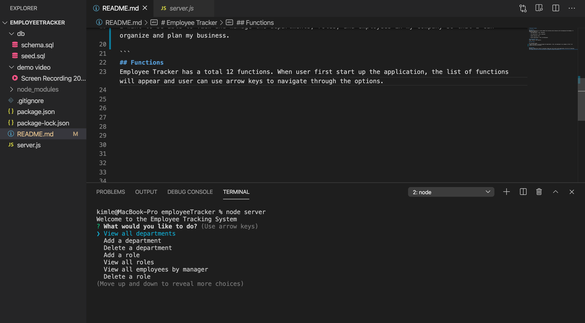

# Employee Tracker

## Overview 
Employee Tracker-CLI is a node command line interface that interacts with the Employees SQL Database. It allows the users to:
  * Add departments, roles, employees

  * View departments, roles, employees

  * Update employee roles

  * Delete departments, roles, and employees

## Technologies Used 
mySQL, Node.js, and inquirer. 

## User Story 
```
As a business owner
I want to be able to view and manage the departments, roles, and employees in my company so that I can organize and plan my business.

```
## Functions
Employee Tracker has a total 12 functions. When user first start up the application, the list of functions will appear and user can use arrow keys to navigate through the options. 




